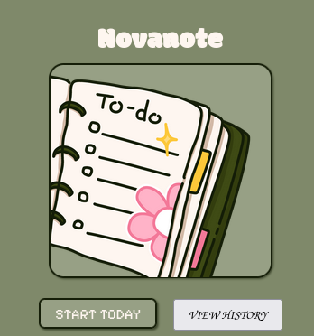

# 🌱 Novanote
<br>
**A clean, motivational daily planner & journaling desktop app** built with Electron.

Novanote helps you stay focused and intentional every day by combining task management, daily reflections, progress tracking, and a personal history log — all with a beautiful pixel-art aesthetic.

## ✨ Features

- **✅ Unlimited Daily Tasks** — Add, edit, complete, and delete tasks
- **📝 Daily Journaling** — Write reflections and notes that auto-save
- **📊 Real-time Progress** — Live progress bar with percentage
- **📅 Full History Viewer** — Browse all past days with progress summaries
- **💾 Persistent & Safe Storage** — Data is saved locally and survives app restarts
- **🎨 Beautiful Retro Design** — Consistent pixel-art / nature theme
- **⌨️ Keyboard Friendly** — Press `Enter` to quickly add tasks
- **🌟 Motivational Finish Screen** — Emoji feedback based on your performance

## 🚀 Quick Start

### For Users (Running the App)

1. Download the latest release for your OS (Windows / macOS / Linux)
2. Install and open Novanote
3. Click **"START TODAY"** and begin building better days!

### For Developers

```bash
# Clone the repository
git clone https://github.com/nova0408-glitch/novanote.git
cd novanote

# Install dependencies
npm install

# Run in development mode
npm start
